# ShinySide

## Table of contents
### 1. Overview
### 2. User Guide
#### 2.2 Extracting Keywords
#### 2.2 Graphical Exploration
#### 2.3 Creating Features
### 3. Developer Guide
#### 3.1 Architecture
#### 3.2 Source Files
#### 3.3 Deploying the App

## Overview

ShinySide is a text-mining tool inspired by [LightSide](http://ankara.lti.cs.cmu.edu/side/download.html), a Java application developed by folks from [Carnegie Mellon University](http://www.cmu.edu/).

LightSide doesn't quite meet all my needs (for one, it only supports `*.csv` files), but it's quite rich in functionality.

It's not my intention to replicate all of LightSide's features, but I might come back to this project and add enhancements in the future. 

Often in machine learning problems one needs to work with unstructured data. For instance, let's say that we have some data from a property rental website where each property has a field named "description" as follows:

        Spacious 1 Bedroom 1 Bathroom in Williamsburg!
        
        Apartment Features:
        
        - Renovated Eat in Kitchen With Dishwasher
        - Renovated Bathroom- Beautiful Hardwood Floors
        - Lots of Sunlight- Great Closet Space
        - Freshly Painted- Heat and Hot Water Included
        - Live in Super Nearby L, J, M & G Trains ! 
        
        Contact Information:
        Kenneth Beak Exclusive Agent
        C: 064-692-8838
        Email: kagglemanager@renthop.com
        
        Text or Email to schedule a private viewing!

This field, in it's raw form, is not suitable for machine learning. In a perfect world, one would rather have structured data such as this:

|apartment_id|dishwasher|hardwood_floors|sunlight|closet_space|freshly_painted|heat_included|
|------------|----------|---------------|--------|------------|---------------|-------------|
|123         |TRUE      |TRUE           |TRUE    |TRUE        |TRUE           |TRUE         |
|456         |TRUE      |TRUE           |FALSE   |TRUE        |FALSE          |TRUE         |
|789         |FALSE     |TRUE           |TRUE    |TRUE        |TRUE           |FALSE        |

The purpose of ShinySide is to offer some basic text-mining functionality for feature extraction such as:

* Explore text data from some input data-set.
* Extract [n-grams](https://en.wikipedia.org/wiki/N-gram) (keywords) that could potentially be used as features.
* Explore and visualize with the aid of visual tools (such as word clouds) the n-grams in the data-set.
* Choose some sub-set of keywords and generate corresponding features for them.
* Export a data-set with the new features.

The main purpose of this project is to showcase my text-mining and data product development skills. It's also serves as a proof of concept.

I would rather code a production ready product in Scala, Clojure, Java or JavaScript. Shiny, as you may know, is more suitable for quick prototyping.

## User Guide

### Loading the Input Data

You should get the following screen when opening the app from RStudio or remotely from [shinyapps.io](https://marciogualtieri.shinyapps.io/shinyside/):

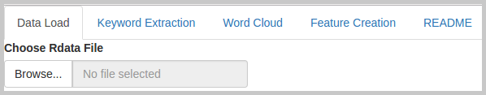

At the moment only `*.rda` (R Data format) files are supported, which is a serialization format for data frames.

Developers and data scientists can harness the power of R to convert any source of data to a data frame, which can be easily saved to `*.rda`:

    
    saveRDS(some_data_frame, "some_data_frame.rda")
    
    
You may also load a `*.rda` file to R by running the following command:

    
    some_data_frame <- readRDS("some_data_frame.rda")
    

I strongly recommend downloading the sample `*.rda` file used for generating the screenshots in this guide, which is available [here](input/renthop.rda). 

This app has been hosted in shinyapps.io under a free sign-up plan, which means that it has some [limitations](https://support.rstudio.com/hc/en-us/articles/217592947-What-are-the-limits-of-the-shinyapps-io-Free-plan-): If you try the app with an input file that is too big, you may get the error "Disconnected from Server" due to the memory limitation of 1 GB of the free plan.

Once you download the sample file to your local machine, click the `Browse` button and load it:

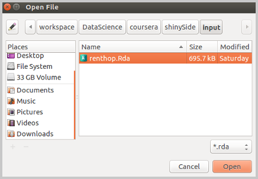

After the uploading is complete, you will see the following screen:

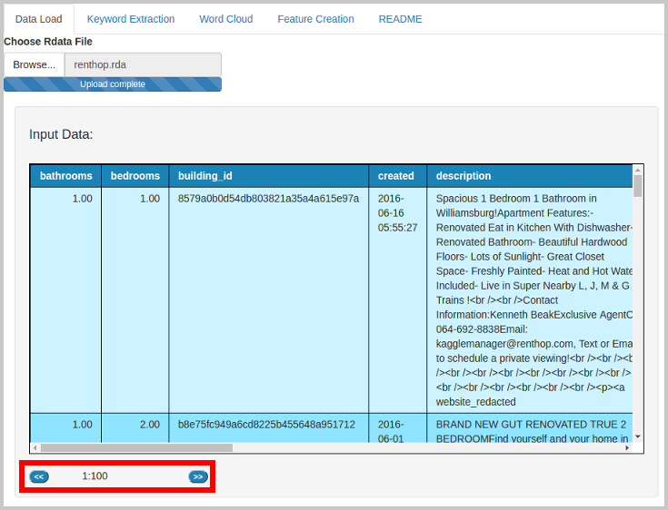

At the bottom of the table, you will see two pagination buttons (previous and next page) and a label with the range of records shown. You may use them to navigate the input data. Each page shows one hundred records.

### Extracting Keywords

Once the input data is loaded, you may click the next tab, "Keywords Extraction". You should see the following screen:

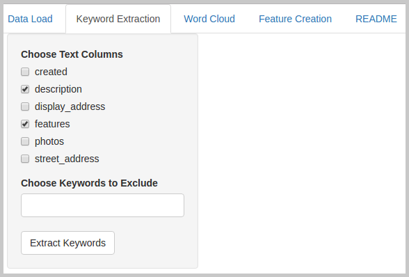

Select the text columns you wish to extract keywords from and click the button `Extract`. You should see the following screen:

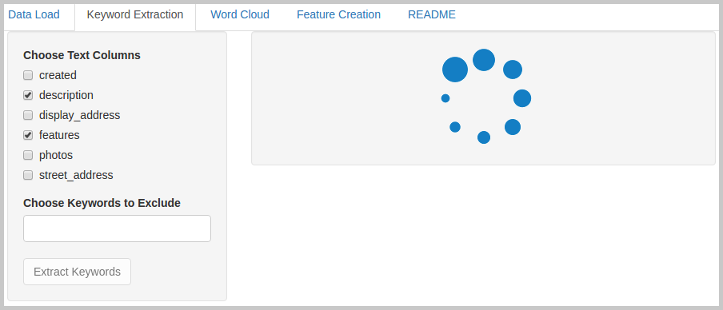

Only text columns are shown. They can be either of type `character` or `list` of `character`.

It might take a few seconds to complete. Once the keywords have been extracted, you should see the following screen:

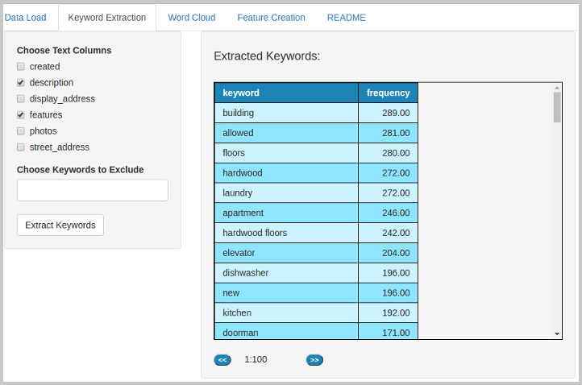

Keywords are n-grams containing one to five words, such as, "renovated", "dogs allowed", "washing machine", "stainless steel appliances", etc.

Often the extraction will return keywords that don't have much value. In the sample data, "websiteredacted" and "kagglemanagerrenthopcom" for instance.

If you wish, you may remove them by selecting them from the "Choose Keywords to Remove" list:

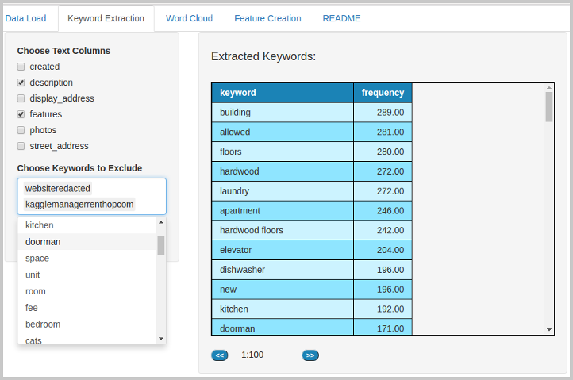

Just select the keywords you wish to exclude from the drop down list. Once you are happy with your selection, click the "Extract" button again to get a new set of keywords without the excluded keywords.

### Graphical Exploration

We can do better than tables when the subject is visualizing keywords. We may plot a word cloud! Click the tab "Word Cloud". You should see the following screen:

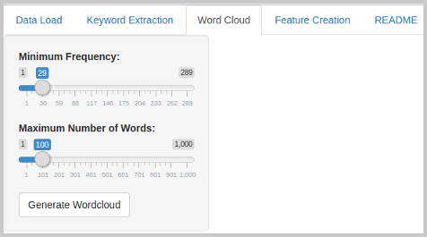

Click the button "Generate Wordcloud"" to render the plot:

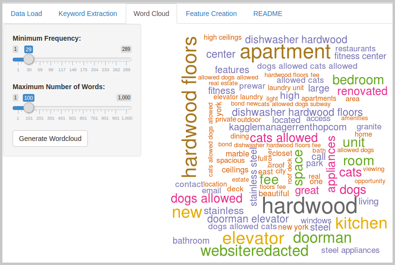

You may use the sliders on the side panel on the left to change the frequency threshold and the maximum number of words to show in the plot.

### Creating Features

The final step is creating features from the keywords available. Click the tab "Feature Creation". You should see the following screen:

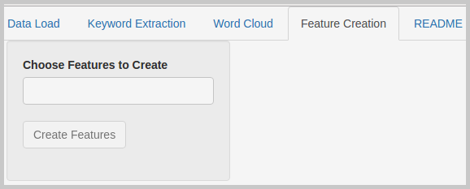

Click "Choose Features to Create" to select the keywords you want to be used as features:

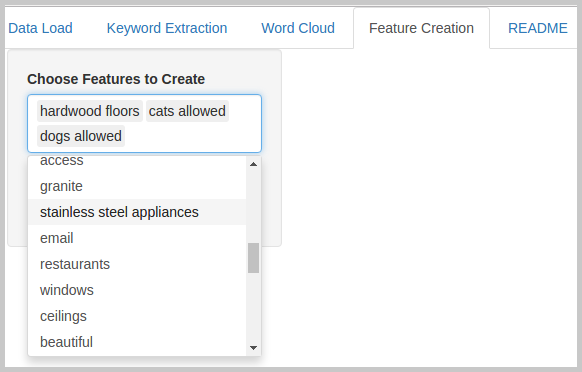

Click the button "Create Features". Once feature creation is complete, you should see the following screen:

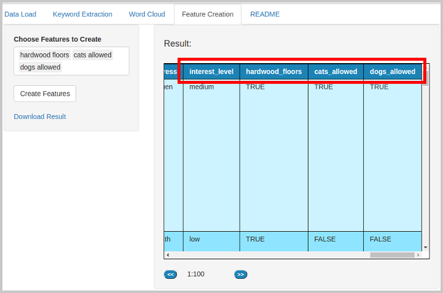

Note that columns correspondent to each keyword have been added to the data-set. You may now export the result data-set by clicking the "Download Result" link:

## Developer Guide

### Architecture

I have followed a somewhat loose [MVC pattern](https://en.wikipedia.org/wiki/Model%E2%80%93view%E2%80%93controller) in this project as an attempt to keep the source files small and manageable.

As you might have noticed, the application is comprised of multiple screens each one built in a different tab.

Each tab in the application has a correspondent view and controller (or rather "model/controller" if you want to be more precise).

<!---
custom_mark2
  digraph G {
    ShinyServer -> LoaderController;
    ShinyServer -> ExtractorController;
    ShinyServer -> WordCloudController;
    ShinyServer -> CreatorController;
    LoaderController [shape=box];
    ExtractorController [shape=box];
    WordCloudController [shape=box];
    CreatorController [shape=box];
  }
custom_mark2
-->

<!---
custom_mark3
  digraph G {
    LoaderView [shape=box];
    ExtractorView [shape=box];
    WordCloudView [shape=box];
    CreatorView [shape=box];
    ShinyUI -> LoaderView;
    ShinyUI -> ExtractorView;
    ShinyUI -> WordCloudView;
    ShinyUI -> CreatorView;
  }
custom_mark3
-->

In short, whatever code you would be put inside `ShinyUI()` is a view and whatever code you would be put inside `ShinyServer()` is a controller.

### Source Files

        ├── controllers
        │   ├── creatorController.R
        │   ├── extractorController.R
        │   ├── loaderController.R
        │   ├── tableController.R
        |   ├── wordcloudController.R
        │   └── readmeController.R
        |
        └── views
            ├── creatorView.R
            ├── extractorView.R
            ├── loaderView.R
            ├── tableView.R
            ├── wordcloudView.R
            └── readmeView.R

Note that there is a folder named "controllers" with a correspondent controller for each one of the tabs:

* loaderController.R ("Data Load").
* extractorController.R ("Keyword Extraction").
* wordcloudController.R( "Word Cloud").
* creatorController.R ("Feature Creation").
* readmeController.R ("README").

There's also a "views" folder with the correspondent views.

Note also that the exception for the rule is the file named "tableController.R": Given that table viewers are necessary in multiple screens, I have created a "custom widget" for building a table viewer that can be re-used anywhere, thus "tableController.R" and "tableView.R".

        ├── tests
        │   ├── testthat.tableController.R
        │   └── testthat.utils.R
        └── runTests.R

I couldn't find a nice way to do UI test automation using R, but I have used [TestThat](https://github.com/hadley/testthat) to unit test the back-end code. You may run unit tests by running "runTests.R" using the command-line or on RStudio.

Back-end operations include tasks such as transforming data and text-mining. 

For text-mining I'm using the following R packages:

* [qdap](https://github.com/trinker/qdap)

* [tm](https://www.rdocumentation.org/packages/tm/)

* [Rweka](https://www.rdocumentation.org/packages/RWeka)

* [wordcloud](https://cran.r-project.org/web/packages/wordcloud/index.html)

Which can be used to perform operations such as creating a corpus from input text, cleaning up text (removing punctuation, stop words, block words, etc), extracting n-grams and computing n-grams frequency.

Some of the widgets need to be modified on-the-fly (hiding and showing the progress `*.gif` for instance). For this purpose I'm using [shinyjs](https://github.com/daattali/shinyjs), which allows the modification of HTML attributes. I have defined some custom CSS classes in "www/style.css", which can be applied using ShinyJs. Shiny does not allow the modification of the attribute class for its widgets. The source file "styles.R" contains code which assign CSS classes to widgets.

        ├── www
        |    ├── images
        |    │   └── loading.gif
        |    └── style.css
        |
        ├── styles.R
        └── utils.R

Inside "www" you will find the CSS file I'm using for this project as well as the "loading `*.gif`" inside images.

The remaining source files are the standard ones for a Shiny project, so I won't comment further on them.

        |
        ├── globals.R
        ├── server.R
        └── ui.R

### Deploying the App

For my own use (I'm pretty sure I'm going to forget it), here are the instructions to deploy the app to shinyapps.io:

1. Install the "rsconnect" package if you haven't done it already:

          install.packages("rsconnect")

2. Sign-up to [shinyapps.io](https://shinyapps.io). You will get an username, token and secret.

3. Authorize your account by running the following R command:

          rsconnect::setAccountInfo(name='<YOUR USERNAME>',
      			  token='<YOUR TOKEN>',
      			  secret='<SECRET>')
			  
4. Deploy your app by running the following R command:

        library(rsconnect)
        rsconnect::deployApp('path/to/ShinySide')

Once you have the app deployed, you might manage your app and debug out issues using [shinyapps.io's dashboard](https://support.rstudio.com/hc/en-us/articles/220339568-What-does-Disconnected-from-Server-mean-in-shinyapps-io-).
